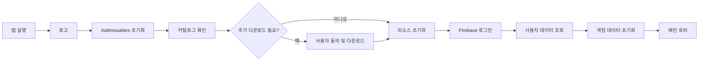
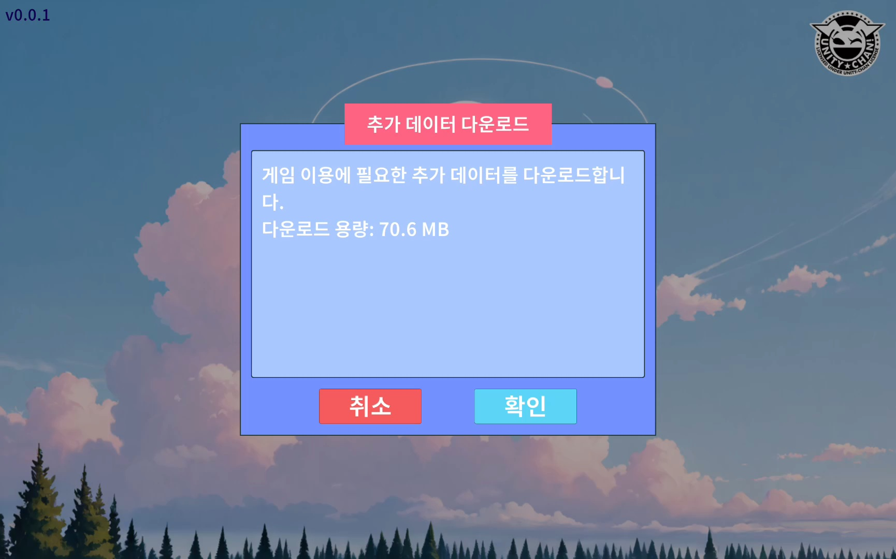
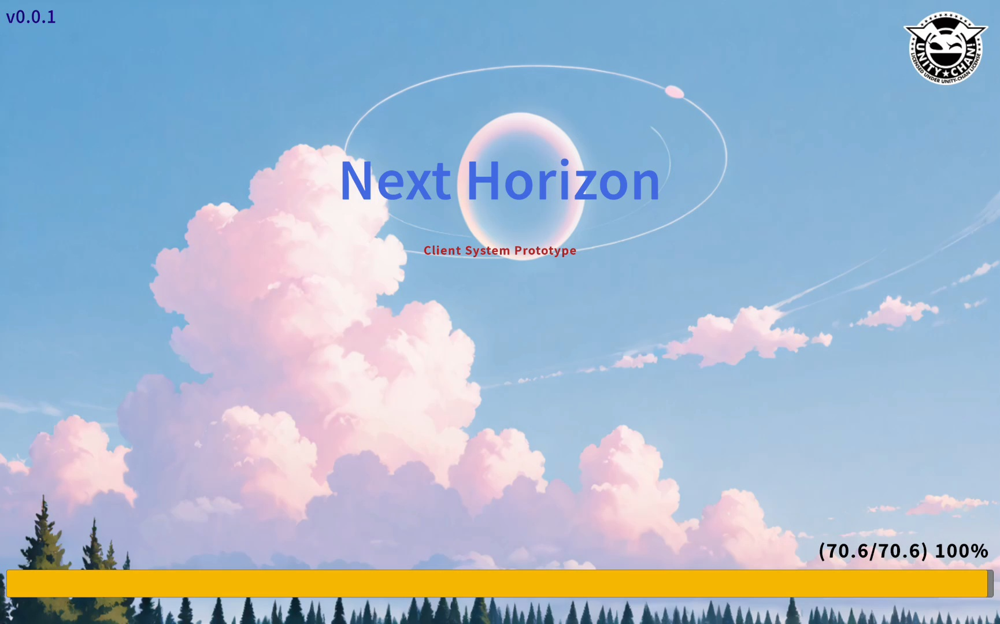
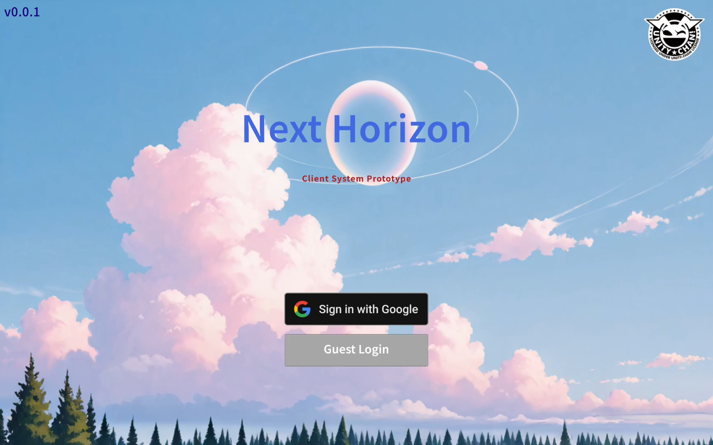
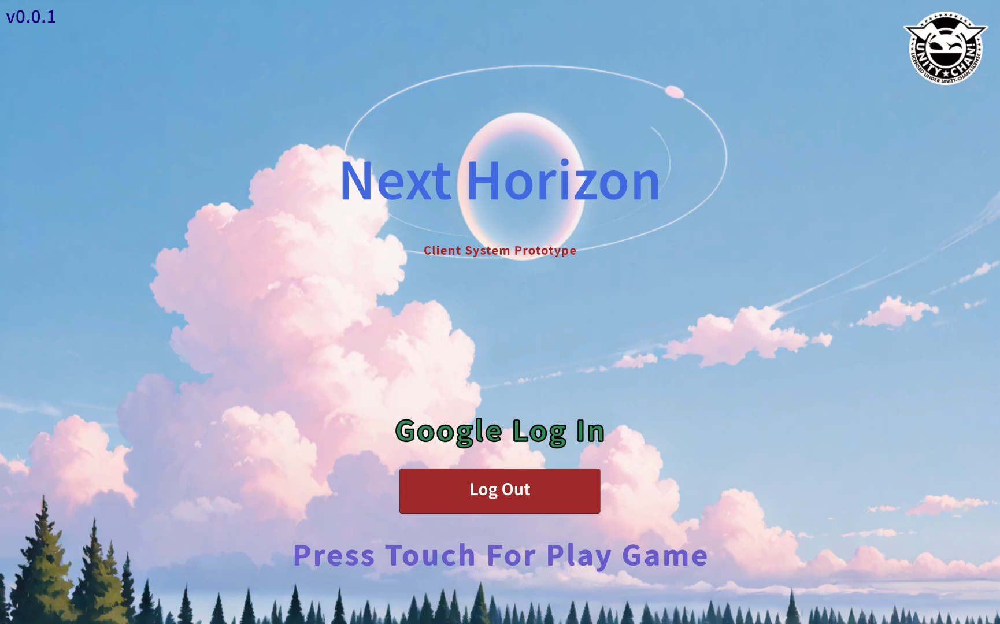
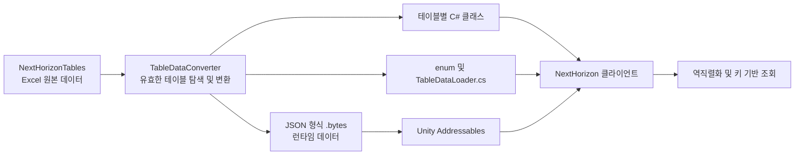
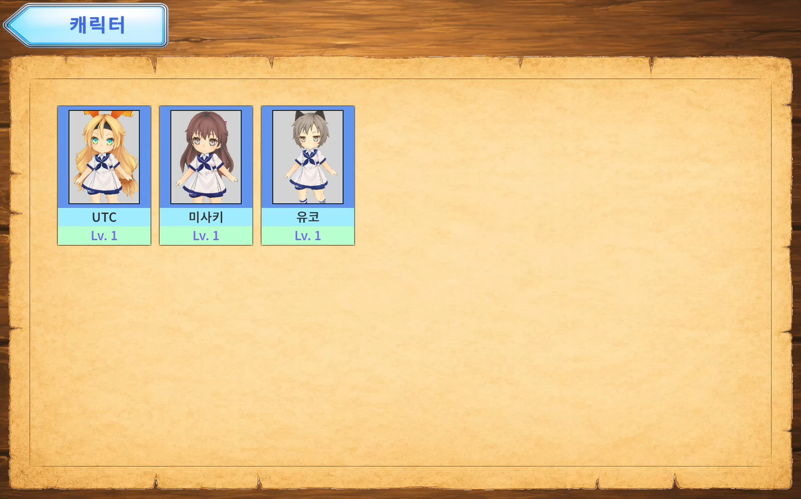
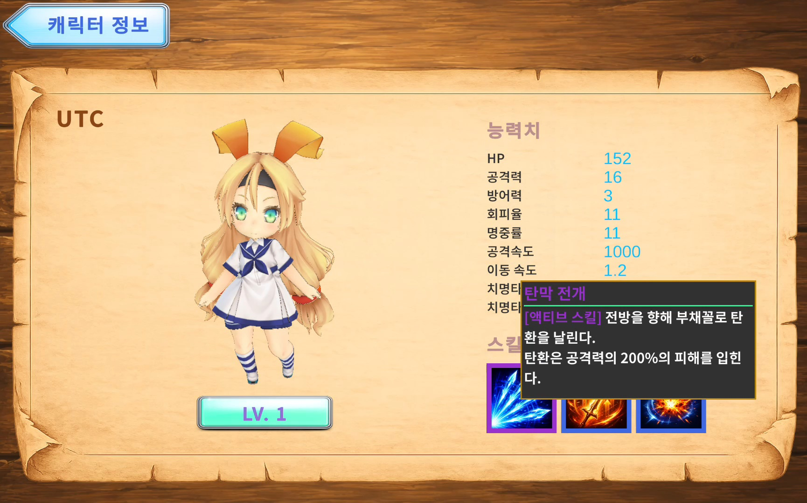
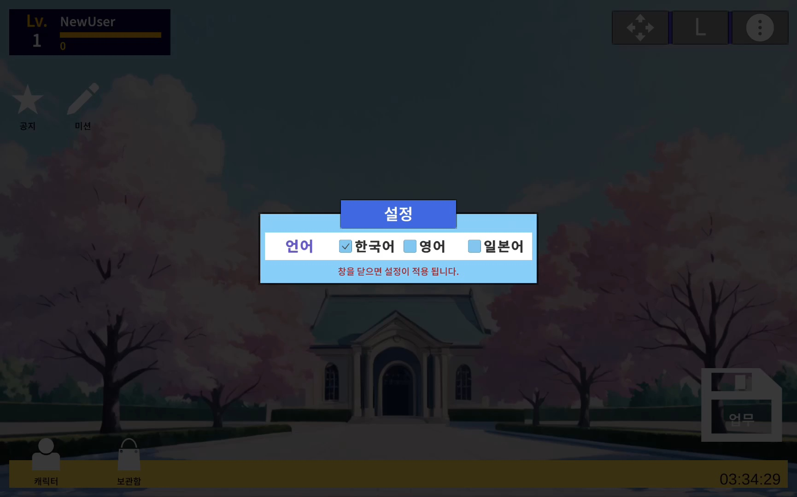
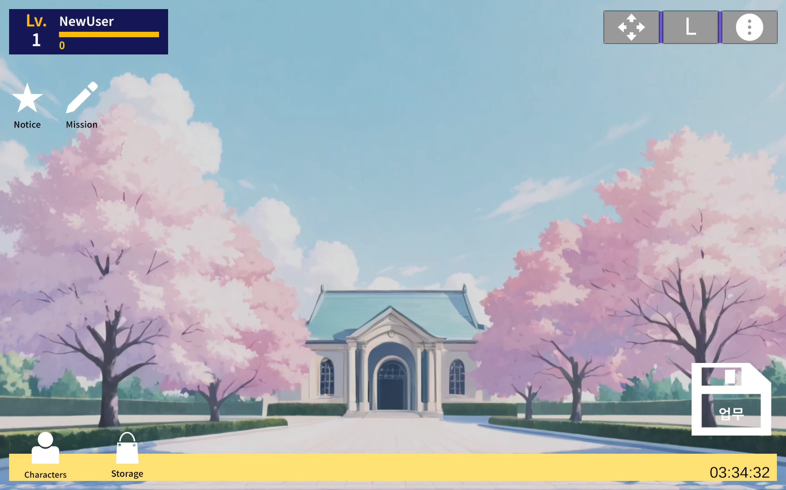

# NextHorizon

Unity로 개발한 모바일 수집형 RPG 프로젝트입니다.

[📱 Android APK 다운로드 (v0.0.6)](https://github.com/GyoolTomato/NextHorizon_Portfolio/releases/tag/v0.0.6)

라이브 서비스형 게임의 클라이언트 구조를 경험하기 위해 인증, 원격 리소스 관리, 데이터 테이블, 다국어 UI와 캐릭터 정보 화면을 구현했습니다.

> 이 저장소는 포트폴리오 검토를 위한 C# 코드 저장소입니다.  
> 서버, 인증 설정, 원본 에셋 및 Unity 프로젝트 전체는 포함하지 않습니다.


## 프로젝트 개요

| 항목 | 내용 |
|---|---|
| 장르 | 모바일 수집형 RPG |
| 개발 환경 | Unity, C# |
| 개발 인원 | 1인 개발 |
| 담당 업무 | 프로젝트 기획, 클라이언트 개발, UI 및 시스템 구현 전반 |

## 구현 기능

- Firebase Authentication 기반 Google 및 익명 로그인
- REST API를 이용한 사용자 데이터 조회
- Addressables 카탈로그 갱신 및 추가 리소스 다운로드
- 캐릭터 목록 및 능력치·스킬 상세 패널
- 미션, 공지, 상점 및 가챠 UI
- JSON 테이블 기반 콘텐츠 데이터 관리
- 한국어·영어·일본어 실시간 언어 변경
- FSM 기반 초기화 및 씬 상태 전환

## 실행 흐름



## 핵심 구현

### 1. Addressables 리소스 관리

앱 시작 시 Addressables를 초기화하고 원격 카탈로그의 변경 여부를 확인합니다. 추가 리소스가 있으면 다운로드 용량을 안내하고, 사용자 동의 후 진행률을 표시하며 내려받습니다.

다운로드가 끝나면 UI 패널, 데이터 테이블, 스프라이트를 비동기로 로드하여 각 Dictionary에 캐싱합니다.

| 추가 데이터 다운로드 안내 | 다운로드 완료 |
|---|---|
|  |  |

주요 처리:

- 비동기 핸들의 유효성과 성공 여부 검사
- 카탈로그 확인 및 갱신
- 다운로드 용량 계산과 사용자 확인
- 다운로드 진행률 UI 연동
- 패널, 테이블, 스프라이트 캐싱
- 로드 실패 시 흐름 중단 및 오류 처리
- Addressables 핸들과 인스턴스 해제

관련 코드:

- [Manager_Addressable.cs](Scripts/_Common/Managers/Manager_Addressable.cs)
- [LogoState_Download.cs](Scripts/0_Logo/FSM/LogoState_Download.cs)
- [Com_Title_Download.cs](Scripts/0_Logo/Prefabs/Com_Title_Download.cs)

### 2. 인증 및 사용자 데이터 연동

Firebase Authentication과 Google Sign-In을 사용하여 Google 로그인과 익명 로그인을 구현했습니다. 인증에 성공하면 UID를 이용해 서버에 사용자 데이터를 요청하고, 응답 결과로 플레이어 데이터를 초기화한 뒤 게임 씬으로 이동합니다.



| Google 로그인 완료 | Guest 로그인 완료 |
|---|---|
|  |  |

주요 처리:

- Firebase 의존성 확인 및 인증 초기화
- Google 로그인과 익명 로그인 분기
- 로그인 취소 및 실패 예외 처리
- 로그인 진행 상태를 UI에 반영
- REST API 응답을 전역 플레이어 데이터로 변환

관련 코드:

- [Com_Title_Login.cs](Scripts/0_Logo/Prefabs/Com_Title_Login.cs)
- [LogoState_LogIn.cs](Scripts/0_Logo/FSM/LogoState_LogIn.cs)
- [GlobalData_PlayerInfo.cs](Scripts/_Common/GlobalData/GlobalData_PlayerInfo.cs)

### 3. 공통 UI 구조

패널과 UI 컴포넌트의 공통 동작을 기반 클래스로 정의했습니다. 목록형 UI는 제네릭 슬롯 컨테이너로 구성하여 캐릭터와 미션 등 여러 콘텐츠에서 같은 생성 및 관리 방식을 사용할 수 있게 했습니다.

주요 처리:

- 패널의 표시 상태와 생명주기 통일
- UI 컴포넌트의 초기화 및 갱신 구조 공통화
- 제네릭 기반 슬롯 목록 생성
- UI Manager를 통한 패널 생성, 캐싱 및 표시
- 프레임 단위와 1초 단위 UI 갱신 분리

관련 코드:

- [Panel_Base.cs](Scripts/_Common/Bases/Panel_Base.cs)
- [Com_Base.cs](Scripts/_Common/Bases/Com_Base.cs)
- [Panel_Slots.cs](Scripts/_Common/Bases/Panel_Slots.cs)
- [Com_Slots.cs](Scripts/_Common/Bases/Com_Slots.cs)
- [Manager_UI.cs](Scripts/_Common/Managers/Manager_UI.cs)

### 4. 데이터 테이블

캐릭터, 아이템, 장비, 스킬, 미션 및 다국어 텍스트를 JSON 테이블로 분리했습니다. Addressables로 로드한 테이블을 역직렬화하여 게임 로직과 UI에서 공통 데이터로 사용합니다.

#### 데이터 제작 파이프라인

게임 데이터의 원본과 변환 도구를 별도 저장소로 분리했습니다. 기획 데이터는 [NextHorizonTables](https://github.com/GyoolTomato/NextHorizonTables)의 Excel 파일로 관리하고, 직접 개발한 WinForms 도구 [TableDataConverter](https://github.com/GyoolTomato/TableDataConverter)로 Unity에서 사용하는 데이터와 코드를 생성합니다.



Excel의 2행은 변수명, 3행은 자료형, 4행부터는 실제 데이터로 정의합니다. 컨버터는 `_*.xlsx` 파일을 읽어 다음 산출물을 자동 생성합니다.

- `Assets/Tables`: JSON 형식의 `.bytes` 데이터
- `Assets/Scripts/_Common/Tables`: 테이블별 C# 클래스와 `TableDataLoader.cs`
- `Assets/Scripts/_Common/GlobalData`: enum C# 코드

이 구조로 원본 데이터, 자동 생성 코드, 런타임 로딩 로직의 역할을 분리했습니다. 테이블 구조가 변경되어도 Excel과 컨버터를 기준으로 산출물을 다시 생성하므로 반복적인 클래스 작성과 데이터 입력 오류를 줄일 수 있습니다.

주요 처리:

- Excel 기반 원본 테이블과 Unity 산출물 분리
- `.bytes`, 데이터 클래스, enum 및 로더 코드 자동 생성
- 콘텐츠 데이터와 로직 분리
- 테이블별 데이터 모델 구성
- 키 기반 데이터 조회
- 한국어·영어·일본어 문자열 테이블 관리
- 스프라이트 리소스와 테이블 데이터 연결

관련 코드:

- [TableDataLoader.cs](Scripts/_Common/Tables/TableDataLoader.cs)
- [Manager_Table.cs](Scripts/_Common/Managers/Manager_Table.cs)
- [Manager_Resources.cs](Scripts/_Common/Managers/Manager_Resources.cs)

### 5. 캐릭터 정보 및 다국어 UI

캐릭터 목록에서 선택한 캐릭터의 일러스트, 능력치와 스킬 정보를 상세 패널에 표시합니다. 캐릭터명, 능력치명, 스킬명과 설명은 데이터 테이블의 텍스트 키를 통해 현재 언어에 맞게 조회합니다.





설정 패널에서는 한국어, 영어, 일본어를 선택할 수 있습니다. 설정 창을 닫으면 열려 있는 패널을 새로고침하여 선택한 언어를 화면에 반영합니다.

| 언어 선택 | 영어 적용 결과 |
|---|---|
|  |  |

관련 코드:

- [Panel_Characters.cs](Scripts/1_Game/Prefabs/Character/Panel_Characters.cs)
- [Panel_CharacterInfo.cs](Scripts/1_Game/Prefabs/Character/Panel_CharacterInfo.cs)
- [Com_CharacterInfo_Info_Stats.cs](Scripts/1_Game/Prefabs/Character/Com_CharacterInfo_Info_Stats.cs)
- [Com_CharacterInfo_Info_Skills.cs](Scripts/1_Game/Prefabs/Character/Com_CharacterInfo_Info_Skills.cs)
- [Panel_Settings.cs](Scripts/1_Game/Prefabs/Main/Panel_Settings.cs)
- [TextSupport.cs](Scripts/_Common/Others/TextSupport.cs)

### 6. FSM 기반 상태 관리

로고, 리소스 다운로드, 로그인 상태를 각각 분리하고 상태별 진입, 종료, 갱신 동작을 관리했습니다. 게임 씬에서도 같은 구조를 사용하여 로비와 플레이 상태의 전환 기반을 구성했습니다.

관련 코드:

- [SceneState.cs](Scripts/_Common/FSM/SceneState.cs)
- [LogoScene.cs](Scripts/0_Logo/LogoScene.cs)
- [LogoState.cs](Scripts/0_Logo/FSM/LogoState.cs)
- [GameScene.cs](Scripts/1_Game/GameScene.cs)
- [GameState.cs](Scripts/1_Game/FSM/GameState.cs)

## 기술 스택

| 분류 | 기술 |
|---|---|
| Engine | Unity |
| Language | C# |
| Resource | Unity Addressables |
| Authentication | Firebase Authentication, Google Sign-In |
| Data | Excel, ClosedXML, Newtonsoft.Json, REST API |
| Tool | .NET 8 WinForms, TableDataConverter |
| Async | MEC Coroutine |

## 폴더 구조

```text
Scripts/
├─ 0_Logo/       # 로고, 리소스 다운로드 및 로그인
├─ 1_Game/       # 로비 콘텐츠와 게임 데이터
├─ 2_Play/       # 플레이 캐릭터
└─ _Common/      # 공통 매니저, UI 기반 클래스 및 테이블
```

## 외부 에셋 및 라이선스

데모 이미지와 APK에 등장하는 캐릭터 모델에는 유니티짱 라이선스에 따라 제공되는 에셋이 사용되었습니다.

© Unity Technologies Japan/UCL

- [유니티짱 라이선스](https://unity-chan.com/contents/license_jp/)
- [캐릭터 이용 가이드라인](https://unity-chan.com/contents/guideline/)

본 저장소에는 유니티짱 원본 모델 및 에셋 데이터가 포함되어 있지 않습니다.

## 안내

- 이 저장소의 코드는 포트폴리오 열람 목적으로 공개합니다.
- 서버 코드, 인증 설정, 원본 리소스 및 외부 에셋은 공개 범위에서 제외했습니다.
- 실행에 필요한 Unity 프로젝트 전체가 아니므로 이 저장소만으로는 빌드할 수 없습니다.
