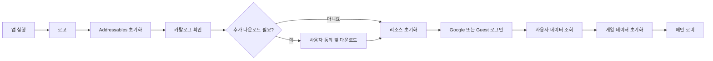
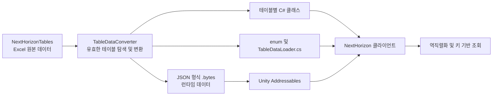

# NextHorizon

기획부터 Unity 클라이언트, 서버 API, 데이터 제작 도구까지 직접 설계하고 구현한 모바일 수집형 RPG 프로젝트입니다.

[📱 Android APK 다운로드 (v1.0.1)](https://github.com/GyoolTomato/NextHorizon_Portfolio/releases/tag/v1.0.1)

단순한 화면 구현에 그치지 않고 인증, 서버 데이터 연동, 원격 리소스 관리, 데이터 테이블 자동화와 다국어 UI를 하나의 실행 흐름으로 연결했습니다.

## 프로젝트 개요

| 항목 | 내용 |
|---|---|
| 장르 | 모바일 수집형 RPG |
| 개발 환경 | Unity, C# |
| 개발 인원 | 1인 개발 |
| 담당 업무 | 기획, Unity 클라이언트, UI, 서버 API, DB 구조 및 데이터 제작 도구 개발 |

## 프로젝트 핵심 요약

| 항목 | 요약 |
|---|---|
| 프로젝트 | 라이브 서비스 구조를 목표로 제작한 Unity 모바일 수집형 RPG |
| 개발 범위 | 기획, Unity 클라이언트, UI, 서버 API, DB, 데이터 제작 도구를 혼자 설계·구현 |
| 핵심 구현 | Google·Guest 로그인, 서버 데이터 연동, Addressables, 캐릭터·인벤토리·성장·미션, 다국어 UI |
| 기술적 강점 | 클라이언트·서버·Excel 테이블을 연결하고 반복 데이터 생성을 전용 도구로 자동화 |
| AI 활용 | Codex를 변경 영향 분석, 디버깅, 리팩터링 검토와 코드 리뷰에 활용 |
| 구현 규모 | 콘텐츠·성장·다국어 데이터 테이블 모델 20개, 인증·플레이어·인벤토리·미션 API 요청 메서드 27개, 지원 언어 3개 |
| 결과물 | Android APK, 포트폴리오용 C# 코드, Excel 원본 데이터, WinForms 테이블 변환 도구 |

빠르게 확인하기:

- [Android APK 실행](https://github.com/GyoolTomato/NextHorizon_Portfolio/releases/tag/v1.0.0)
- [핵심 구현 설명](#핵심-구현)
- [직접 수행한 작업](#직접-수행한-작업)
- [대표 문제 해결 사례](#대표-문제-해결-사례)
- [Codex 활용과 AI 협업 경험](#codex-활용과-ai-협업-경험)


## 직접 수행한 작업

프로젝트의 요구사항 정의와 구조 설계, 구현 방향 결정, 코드 수정 및 실행 검증을 직접 담당했습니다.

- Unity 프로젝트 구조와 로고·다운로드·로그인·로비 상태 흐름 설계
- Firebase Authentication 및 Google Sign-In 연동
- REST API 요청·응답 모델과 클라이언트 데이터 초기화 구조 구현
- Node.js 서버 API와 SQLite·Prisma 기반 사용자 데이터 구조 구현
- Addressables 원격 카탈로그 확인, 추가 다운로드 및 리소스 캐싱 구현
- 캐릭터, 인벤토리, 장비, 성장, 미션 및 플레이어 정보 UI 구현
- Excel 원본 데이터를 Unity용 JSON·C# 코드로 변환하는 WinForms 도구 개발
- 한국어·영어·일본어 데이터 테이블과 런타임 언어 변경 기능 구현
- 오류 재현, 로그 분석, 코드 수정 및 실제 실행 결과 검증

관련 저장소:

- [NextHorizonTables](https://github.com/GyoolTomato/NextHorizonTables): Excel 기반 원본 게임 데이터
- [TableDataConverter](https://github.com/GyoolTomato/TableDataConverter): Unity 테이블 및 C# 코드 생성 도구

## 대표 문제 해결 사례

| 문제 | 해결 | 결과 |
|---|---|---|
| 앱 업데이트마다 리소스를 다시 포함해야 하는 구조 | Addressables 원격 카탈로그 확인, 다운로드 용량 안내, 비동기 다운로드 및 캐싱 흐름 구현 | 앱 실행 중 필요한 리소스를 확인하고 추가 데이터만 내려받는 구조 구성 |
| Excel 데이터 변경 때 JSON과 C# 모델을 반복해서 작성하는 작업 | Excel 규칙을 정의하고 `.bytes`, 데이터 클래스, enum 및 로더 코드를 생성하는 WinForms 도구 개발 | 원본 데이터와 런타임 산출물의 생성 과정을 자동화하고 수작업 범위 축소 |
| 로그인 이후 여러 종류의 플레이어 데이터를 일관되게 초기화해야 하는 문제 | 서버 응답 모델을 통합하고 사용자·캐릭터·인벤토리·미션 데이터를 기능별 GameData로 분리 | 로그인부터 로비 진입까지 동일한 서버 데이터를 기준으로 초기화 |
| 플레이어 레벨과 미션 보상 추가로 클라이언트·서버·테이블 모델을 함께 변경해야 하는 상황 | Codex로 저장소별 영향 범위와 데이터 전달 경로를 분석한 뒤 코드·테이블·서버 응답을 직접 대조 | 누락된 변경 지점을 확인하고 로그인부터 보상 반영까지 데이터 흐름을 일관되게 연결 |

## Codex 활용과 AI 협업 경험

Codex를 활용해 여러 저장소의 변경 영향을 빠르게 분석하고, 구현 과정에서 놓치기 쉬운 문제와 개선 가능성을 폭넓게 점검했습니다.

주요 활용 범위:

- 여러 저장소에 걸친 클라이언트·서버·테이블 변경 영향 분석
- 네트워크 요청, 데이터 동기화 및 비동기 실행 흐름의 문제 추적
- 반복 코드와 책임이 섞인 구조의 리팩터링 대안 검토
- 변경 코드 리뷰, 누락된 예외 처리 탐색 및 테스트 항목 정리
- 릴리즈별 변경사항 비교와 릴리즈 노트 초안 작성
- 포트폴리오 README의 정보 구조, 강조 순서 및 문구 검토

AI의 제안은 현재 구조와 데이터 흐름에 맞는지 직접 검토한 뒤 적용 여부를 결정했습니다. 최종 설계 선택, 코드 수정, 실행 검증과 결과에 대한 책임은 개발자인 제가 맡았습니다. 이 과정을 통해 문제와 제약 조건을 명확히 전달하고, 결과를 비판적으로 검토하며, 작업을 검증 가능한 단위로 나누는 AI 협업 방식을 익혔습니다.

## 실행 흐름



## 핵심 구현

### 1. Addressables 리소스 관리

앱 시작 시 Addressables를 초기화하고 원격 카탈로그의 변경 여부를 확인합니다. 추가 리소스가 있으면 다운로드 용량을 안내하고, 사용자 동의 후 진행률을 표시하며 내려받습니다.

다운로드가 끝나면 UI 패널, 데이터 테이블, 스프라이트를 비동기로 로드하여 각 Dictionary에 캐싱합니다.

| 추가 데이터 다운로드 안내 | 다운로드 완료 |
|---|---|
|  |  |

주요 처리:

- 비동기 핸들의 유효성과 성공 여부 검사
- 카탈로그 확인 및 갱신
- 다운로드 용량 계산과 사용자 확인
- 다운로드 진행률 UI 연동
- 패널, 테이블, 스프라이트 캐싱
- 로드 실패 시 흐름 중단 및 오류 처리
- Addressables 핸들과 인스턴스 해제

관련 코드:

- [Manager_Addressable.cs](Scripts/_Common/Managers/Manager_Addressable.cs)
- [LogoState_Download.cs](Scripts/0_Logo/FSM/LogoState_Download.cs)
- [Com_Title_Download.cs](Scripts/0_Logo/Prefabs/Com_Title_Download.cs)

### 2. 인증 및 사용자 데이터 연동

Firebase Authentication과 Google Sign-In을 사용하는 Google 로그인과 기기 로컬 ID를 사용하는 Guest 로그인을 구현했습니다. 인증에 성공하면 UID를 이용해 서버에 사용자 데이터를 요청하고, 응답 결과로 플레이어 데이터를 초기화한 뒤 게임 씬으로 이동합니다.


| Google 로그인 완료 | Guest 로그인 완료 |
|---|---|
|  |  |

주요 처리:

- Firebase 의존성 확인 및 인증 초기화
- Google 로그인과 Guest 로그인 분기
- 로그인 취소 및 실패 예외 처리
- 로그인 진행 상태를 UI에 반영
- REST API 응답을 전역 플레이어 데이터로 변환

관련 코드:

- [Com_Title_Login.cs](Scripts/0_Logo/Prefabs/Com_Title_Login.cs)
- [LogoState_LogIn.cs](Scripts/0_Logo/FSM/LogoState_LogIn.cs)
- [GameData_PlayerInfo.cs](Scripts/1_Game/GameData/GameData_PlayerInfo.cs)

### 3. 공통 UI 구조

패널과 UI 컴포넌트의 공통 동작을 기반 클래스로 정의했습니다. 목록형 UI는 제네릭 슬롯 컨테이너로 구성하여 캐릭터와 미션 등 여러 콘텐츠에서 같은 생성 및 관리 방식을 사용할 수 있게 했습니다.

주요 처리:

- 패널의 표시 상태와 생명주기 통일
- UI 컴포넌트의 초기화 및 갱신 구조 공통화
- 제네릭 기반 슬롯 목록 생성
- UI Manager를 통한 패널 생성, 캐싱 및 표시
- 프레임 단위와 1초 단위 UI 갱신 분리

관련 코드:

- [Panel_Base.cs](Scripts/_Common/Bases/Panel_Base.cs)
- [Com_Base.cs](Scripts/_Common/Bases/Com_Base.cs)
- [Panel_Slots.cs](Scripts/_Common/Bases/Panel_Slots.cs)
- [Com_Slots.cs](Scripts/_Common/Bases/Com_Slots.cs)
- [Manager_UI.cs](Scripts/_Common/Managers/Manager_UI.cs)

### 4. 데이터 테이블

캐릭터, 아이템, 장비, 스킬, 미션 및 다국어 텍스트를 JSON 테이블로 분리했습니다. Addressables로 로드한 테이블을 역직렬화하여 게임 로직과 UI에서 공통 데이터로 사용합니다.

#### 데이터 제작 파이프라인

게임 데이터의 원본과 변환 도구를 별도 저장소로 분리했습니다. 기획 데이터는 [NextHorizonTables](https://github.com/GyoolTomato/NextHorizonTables)의 Excel 파일로 관리하고, 직접 개발한 WinForms 도구 [TableDataConverter](https://github.com/GyoolTomato/TableDataConverter)로 Unity에서 사용하는 데이터와 코드를 생성합니다.



Excel의 2행은 변수명, 3행은 자료형, 4행부터는 실제 데이터로 정의합니다. 컨버터는 `_*.xlsx` 파일을 읽어 다음 산출물을 자동 생성합니다.

- `Assets/Tables`: JSON 형식의 `.bytes` 데이터
- `Assets/Scripts/_Common/Tables`: 테이블별 데이터 클래스, enum 및 `TableDataLoader.cs`

이 구조로 원본 데이터, 자동 생성 코드, 런타임 로딩 로직의 역할을 분리했습니다. 테이블 구조가 변경되어도 Excel과 컨버터를 기준으로 산출물을 다시 생성하므로 반복적인 클래스 작성과 데이터 입력 오류를 줄일 수 있습니다.

주요 처리:

- Excel 기반 원본 테이블과 Unity 산출물 분리
- `.bytes`, 데이터 클래스, enum 및 로더 코드 자동 생성
- 콘텐츠 데이터와 로직 분리
- 테이블별 데이터 모델 구성
- 키 기반 데이터 조회
- 한국어·영어·일본어 문자열 테이블 관리
- 스프라이트 리소스와 테이블 데이터 연결

관련 코드:

- [TableDataLoader.cs](Scripts/_Common/Tables/TableDataLoader.cs)
- [Manager_Table.cs](Scripts/_Common/Managers/Manager_Table.cs)
- [Manager_Resources.cs](Scripts/_Common/Managers/Manager_Resources.cs)

### 5. 캐릭터 정보 및 다국어 UI

캐릭터 목록에서 선택한 캐릭터의 일러스트, 능력치와 스킬 정보를 상세 패널에 표시합니다. 캐릭터명, 능력치명, 스킬명과 설명은 데이터 테이블의 텍스트 키를 통해 현재 언어에 맞게 조회합니다.


설정 패널에서는 한국어, 영어, 일본어를 선택할 수 있습니다. 설정 창을 닫으면 열려 있는 패널을 새로고침하여 선택한 언어를 화면에 반영합니다.

| 언어 선택 | 영어 적용 결과 |
|---|---|
|  |  |

관련 코드:

- [Panel_Characters.cs](Scripts/1_Game/Prefabs/Character/Panel_Characters.cs)
- [Panel_CharacterInfo.cs](Scripts/1_Game/Prefabs/Character/Panel_CharacterInfo.cs)
- [Com_CharacterInfo_Info_Stats.cs](Scripts/1_Game/Prefabs/Character/Com_CharacterInfo_Info_Stats.cs)
- [Com_CharacterInfo_Info_Skills.cs](Scripts/1_Game/Prefabs/Character/Com_CharacterInfo_Info_Skills.cs)
- [Panel_Settings.cs](Scripts/1_Game/Prefabs/Main/Panel_Settings.cs)
- [TextSupport.cs](Scripts/_Common/Others/TextSupport.cs)

### 6. 플레이어 정보 및 계정 성장

서버에서 플레이어의 UID, 닉네임, 레벨, 경험치, 대표 캐릭터, 소개글과 계정 생성일을 불러와 플레이어 정보 패널에 표시합니다. 소개글과 대표 캐릭터를 변경하면 서버 응답을 현재 게임 데이터와 UI에 반영합니다.

플레이어 경험치는 캐릭터 경험치와 별도로 관리하며, 플레이어 레벨 테이블을 기준으로 현재 경험치와 다음 레벨까지 필요한 경험치를 계산합니다.

주요 처리:

- 플레이어 정보 조회와 로컬 게임 데이터 초기화
- 소개글 편집 및 서버 저장
- 보유 캐릭터를 이용한 대표 캐릭터 선택
- 플레이어 경험치와 레벨 진행도 표시
- 계정 생성일 및 보유 캐릭터 수 표시
- 서버 응답 이벤트를 이용한 패널 갱신

관련 코드:

- [Panel_PlayerInfo.cs](Scripts/1_Game/Prefabs/Main/Panel_PlayerInfo.cs)
- [GameData_PlayerInfo.cs](Scripts/1_Game/GameData/GameData_PlayerInfo.cs)
- [ServerAPI.PlayerInfo.cs](Scripts/_Common/ServerAPI/ServerAPI.PlayerInfo.cs)
- [_108_PlayerLevel.cs](Scripts/_Common/Tables/_108_PlayerLevel.cs)

### 7. 인벤토리 및 장비 동기화

아이템, 방어구와 무기를 각각 구분해 관리하고 서버에서 받은 보유 데이터를 인벤토리 UI에 표시합니다. 장비의 고유 ID와 장착 캐릭터 정보를 함께 관리하여 캐릭터별 장착·해제 결과가 서버 데이터와 일치하도록 구성했습니다.

주요 처리:

- 아이템·방어구·무기 데이터 분리 및 키 기반 조회
- 아이템 획득·소비·수량 변경 요청
- 방어구와 무기 목록 조회
- 캐릭터별 장비 장착 및 해제
- 서버 응답을 인벤토리 데이터와 슬롯 UI에 반영
- 동일한 장비 유형의 중복 장착 방지

관련 코드:

- [Manager_Inventory.cs](Scripts/1_Game/Manager/Manager_Inventory.cs)
- [GameData_Inventory.cs](Scripts/1_Game/GameData/GameData_Inventory.cs)
- [ServerAPI.Inventory.cs](Scripts/_Common/ServerAPI/ServerAPI.Inventory.cs)
- [Com_Armor_Slot.cs](Scripts/1_Game/Prefabs/Inventory/Com_Armor_Slot.cs)
- [Com_Weapon_Slot.cs](Scripts/1_Game/Prefabs/Inventory/Com_Weapon_Slot.cs)

### 8. 서버 기반 미션 및 보상 처리

미션의 진행도와 보상 수령 여부를 서버 데이터로 관리합니다. 미션 목록을 콘텐츠 테이블과 결합해 UI를 구성하고, 완료 조건을 충족한 미션의 보상을 요청하면 지급된 아이템과 플레이어 경험치를 현재 게임 데이터에 반영합니다.

주요 처리:

- 미션 테이블과 서버 진행 데이터 결합
- 미션 종류와 갱신 주기별 데이터 분류
- 진행도와 완료 여부에 따른 UI 상태 변경
- 완료 미션의 보상 수령 요청
- 지급 아이템과 플레이어 경험치 동기화
- 보상 수령 완료 이벤트를 이용한 목록 및 메인 UI 갱신

관련 코드:

- [GameData_Missions.cs](Scripts/1_Game/GameData/GameData_Missions.cs)
- [ServerAPI.Mission.cs](Scripts/_Common/ServerAPI/ServerAPI.Mission.cs)
- [Panel_Missions.cs](Scripts/1_Game/Prefabs/Main/Panel_Missions.cs)
- [Com_Missions_Slot.cs](Scripts/1_Game/Prefabs/Main/Com_Missions_Slot.cs)

### 9. FSM 기반 상태 관리

로고, 리소스 다운로드, 로그인 상태를 각각 분리하고 상태별 진입, 종료, 갱신 동작을 관리했습니다. 게임 씬에서도 같은 구조를 사용하여 로비와 플레이 상태의 전환 기반을 구성했습니다.

관련 코드:

- [SceneState.cs](Scripts/_Common/FSM/SceneState.cs)
- [LogoScene.cs](Scripts/0_Logo/LogoScene.cs)
- [LogoState.cs](Scripts/0_Logo/FSM/LogoState.cs)
- [GameScene.cs](Scripts/1_Game/GameScene.cs)
- [GameState.cs](Scripts/1_Game/FSM/GameState.cs)

## 사용 기술

| 분류 | 기술 | 적용 범위 |
|---|---|---|
| Engine | Unity | 클라이언트 실행 구조, UI 및 콘텐츠 구현 |
| Language | C# | Unity 클라이언트와 데이터 변환 도구 개발 |
| Server | Node.js, Express | 인증·사용자·인벤토리·캐릭터·미션 REST API 구현 |
| Database | SQLite, Prisma | 사용자 데이터 모델, 조회·갱신 및 트랜잭션 처리 |
| Resource | Unity Addressables | 원격 카탈로그와 추가 리소스 다운로드·캐싱 |
| Authentication | Firebase Authentication, Google Sign-In | Google 인증 및 Firebase ID 토큰 처리 |
| Guest Account | Local ID, PlayerPrefs | Guest 계정 식별 및 로그인 상태 유지 |
| Data | Excel, ClosedXML, Newtonsoft.Json | 원본 테이블 관리와 JSON·C# 산출물 생성 |
| Tool | .NET 8 WinForms, TableDataConverter | 데이터 제작 파이프라인 자동화 |
| Async | MEC Coroutine | 클라이언트 비동기 초기화와 다운로드 흐름 처리 |

## 폴더 구조

```text
Scripts/
├─ 0_Logo/       # 로고, 리소스 다운로드 및 로그인
├─ 1_Game/       # 로비 콘텐츠와 게임 데이터
├─ 2_Play/       # 플레이 캐릭터
└─ _Common/      # 공통 매니저, UI 기반 클래스 및 테이블
```

## 외부 에셋 및 라이선스

데모 이미지와 APK에 등장하는 캐릭터 모델에는 유니티짱 라이선스에 따라 제공되는 에셋이 사용되었습니다.

© Unity Technologies Japan/UCL

- [유니티짱 라이선스](https://unity-chan.com/contents/license_jp/)
- [캐릭터 이용 가이드라인](https://unity-chan.com/contents/guideline/)

본 저장소에는 유니티짱 원본 모델 및 에셋 데이터가 포함되어 있지 않습니다.

## 안내

- 이 저장소의 코드는 포트폴리오 열람 목적으로 공개합니다.
- 서버 코드, 인증 설정, 원본 리소스 및 외부 에셋은 공개 범위에서 제외했습니다.
- 실행에 필요한 Unity 프로젝트 전체가 아니므로 이 저장소만으로는 빌드할 수 없습니다.
